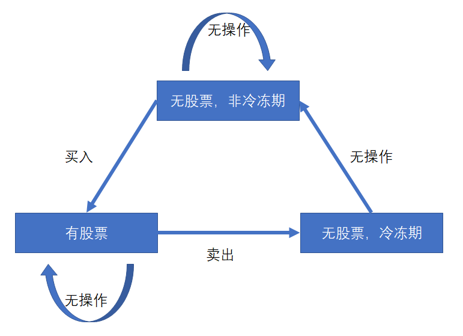

# 309. 最佳买卖股票时机含冷冻期

## 题目
给定一个整数数组，其中第 i 个元素代表了第 i 天的股票价格 。​

设计一个算法计算出最大利润。在满足以下约束条件下，你可以尽可能地完成更多的交易（多次买卖一支股票）:

你不能同时参与多笔交易（你必须在再次购买前出售掉之前的股票）。
卖出股票后，你无法在第二天买入股票 (即冷冻期为 1 天)。
示例:

    输入: [1,2,3,0,2]
    输出: 3 
    解释: 对应的交易状态为: [买入, 卖出, 冷冻期, 买入, 卖出]

来源：力扣（LeetCode）
链接：https://leetcode-cn.com/problems/best-time-to-buy-and-sell-stock-with-cooldown
著作权归领扣网络所有。商业转载请联系官方授权，非商业转载请注明出处。

## 题解

每一天都有三种操作：买入，卖出，无操作

由于最多买入且只能持有一只股票，在卖出后有冷冻期限制，有三种状态：

需要明确的是：
1. 如果今日卖出了股票，则认为今日结束后进入了冷冻期。
2. 如果今日处于冷冻期，则认为今日结束后进入非冷冻期。

dp[i]表示第i天结束后累计的最大收益



在这里，我们认为，在第i日结束后，如果卖出了股票，则进入冷冻期。

在第0天：

1. dp[0][0]:第0天持有股票，收益为-prices[0]
2. dp[0][1]:第0天卖出股票，冷冻期，（不存在该状态）
3. dp[0][2]:第0天没有持有股票，非冷冻期，收益为0

在第i天：

dp[i][0]第i天结束后没有股票，非冷冻期，可能的情况：

1. 第i-1天结束后，处于无股票，非冷冻期，今日无操作，累计收益为：dp[i-1][0]
2. 第i-1天结束后，处于无股票，冷冻期，今天是冷冻期，今日无操作，累计收益为：dp[i-1][2]

即为：
$$
dp[i][0] = max(dp[i-1][0],dp[i-1][2])
$$

dp[i][1]第i天结束后持有股票，可能的情况：

1. 第i-1天结束后，持有股票，今日无操作，累计收益为：dp[i-1][1]
2. 第i-1天结束后，处于处于无股票，非冷冻期，今日买入，累计收益为：dp[i-1][0]-prices[i]

即为：
$$
dp[i][1] = max(dp[i-1][1],dp[i-1][0]-prices[i])
$$

dp[i][2]第i天没有股票，处于冷冻期，可能的情况：

1. 第i-1天结束后，持有股票，今日卖出，累计收益为：dp[i-1][1] + prices[i]

即为：
$$
dp[i][2] = dp[i-1][1] + prices[i]
$$


故有程序如下:
```C++
class Solution {
public:
	int maxProfit(vector<int>& prices) {
		if (prices.size() < 2) return 0;

		vector<vector<int>> dp(prices.size(), { 0,0,0 });

		dp[0][0] = 0;
		dp[0][1] = -prices[0];
		dp[0][2] = 0;

		for (int i = 1; i < prices.size(); i++) {
			dp[i][0] = std::max(dp[i - 1][0], dp[i - 1][2]);
			dp[i][1] = std::max(dp[i - 1][1], dp[i - 1][0] - prices[i]);
			dp[i][2] = dp[i - 1][1] + prices[i];
		}

		return std::max(dp[prices.size() - 1][0], dp[prices.size() - 1][2]);
	}
};
```